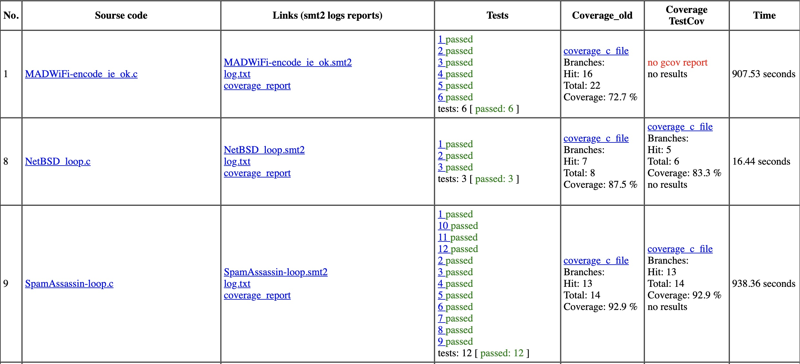
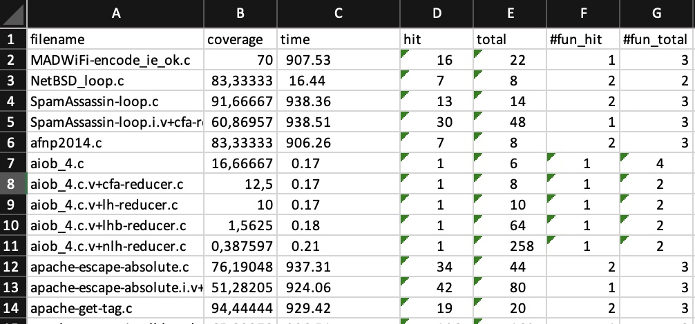

About
=====

Collections of Python Scripts to Run SeaHorn (https://github.com/seahorn/seahorn) with the whole C/C++ repository.
IncludeAdder.py instruments the code (edit IncludeAdder.py before run and modify SOURSE_PATH)
SeaHornLaucher.py runs SeaHorn commands against instrumented (by IncludeAdder.py) .c code. and generates a report.
ReportBuilder generate report based on the previous result or provided a file with raw results.

Requirement 
============

* `Pyhton 3.7 or later`
* `Z3`
* `lcov ?? check version`
* `gcc with coverage`
* `seahorn https://github.com/seahorn/seahorn`
* `genhtml`
* `TestCov` https://gitlab.com/sosy-lab/software/test-suite-validator
  * `clang-tidy`
  * `lxml >= 4.0`
  * `numpy >= 1.15` 
  * `BenchExec >= 1.20` 
  * `pycparser >= 2.19`
  * `matplotlib` (optional)

Run
===
* Download Docker Image `docker pull seahorn/seahorn-llvm10:nightly`
* Creatre work directory `mkdir sandbox` 
* Run docker with mount option `docker run --rm -it --mount type=bind,source=${PATH_TO_REPO}/sandbox,target=/app 
seahorn/seahorn-llvm10:nightly` 
* Ubuntu example `docker container run -it -p 5000:5000 -v /home/fmfsu/HornLauncher/sandbox/:/app seahorn/seahorn-llvm10:nightly /bin/bash
`
* Upload dependencies `pip install -r requirements.txt` (TBD)
* `cd launcher`   
* Edit `TestGen.py` and modify `SOURCE_PATH, OUTPUT_DIR` and other options if needed
* Run `python3 TestGen.py` => report should be created in `OUTPUT_DIR/1/summary`

Report 
======

HTML Report (generated in sandbox directory)

 

Excel Report (generated in sandbox directory)

 